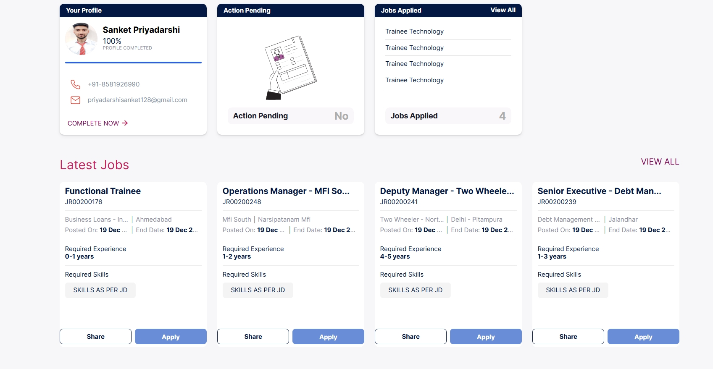

# Progressify

Progressify is a full-stack project management tool designed to help teams organize tasks, track progress, and collaborate effectively.

<!--  -->

## Features

- **User Authentication:** Secure user registration and login system with JWT authentication.
- **Project Management:** Create, update, and delete projects.
- **Task Management:** Assign tasks to team members and track their status.
- **Team Collaboration:** Create and manage teams, and invite members to collaborate on projects.
- **Reporting:** Generate reports to get insights into project progress.
- **Dashboard:** A centralized dashboard to view all your projects and tasks at a glance.

## Tech Stack

### Frontend

- React
- React Router
- Material-UI
- Axios

### Backend

- Node.js
- Express.js
- MongoDB
- Mongoose
- JWT for authentication
- Bcrypt for password hashing

## Getting Started

To get a local copy up and running, follow these simple steps.

### Prerequisites

- Node.js
- npm
- MongoDB

### Installation

1.  **Clone the repository:**
    ```sh
    git clone https://github.com/Sanket9122/Progressify___E.git
    cd Progressify___E
    ```

2.  **Install backend dependencies:**
    ```sh
    npm install
    ```

3.  **Install frontend dependencies:**
    ```sh
    cd client
    npm install
    ```

4.  **Set up environment variables:**

    Create a `.env` file in the `Backend` directory and add the following variables:

    ```
    PORT=5000
    MONGO_URI=<YOUR_MONGODB_URI>
    JWT_SECRET=<YOUR_JWT_SECRET>
    ```

5.  **Run the application:**

    -   **Run the backend server:**
        From the root directory, run:
        ```sh
        npm start
        ```

    -   **Run the frontend application:**
        From the `client` directory, run:
        ```sh
        npm start
        ```

The application will be available at `http://localhost:3000`.

## Folder Structure

```
.
├── Backend
│   ├── config
│   ├── controllers
│   ├── middleware
│   ├── models
│   ├── routes
│   └── ...
├── client
│   ├── public
│   ├── src
│   │   ├── assets
│   │   ├── Components
│   │   ├── context
│   │   ├── Pages
│   │   └── ...
│   └── ...
└── ...
```

<!-- ## Screenshots

**Team Page**
 -->

